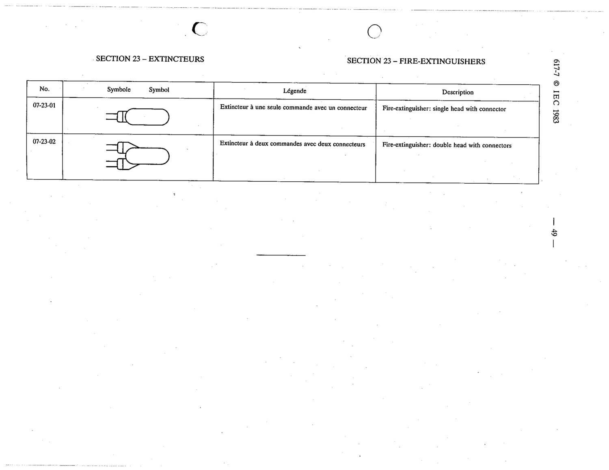

# 07-23-02 — Fire-extinguisher: double head with connectors

This symbol appears on Publication No.617-7.pdf, printed p.49 (full page shown). 617-7 uses page-level images: its table layout is too irregular (intro text, notes, text-only rows) for reliable per-symbol cropping.

**Standard:** [[60617-7]] · **Section:** [[60617-7-23-fire-extinguishers]]

## Description
Fire-extinguisher: double head with connectors

## Names
- **EN:** Fire-extinguisher: double head with connectors
- **FR:** Extincteur à deux commandes avec deux connecteurs

