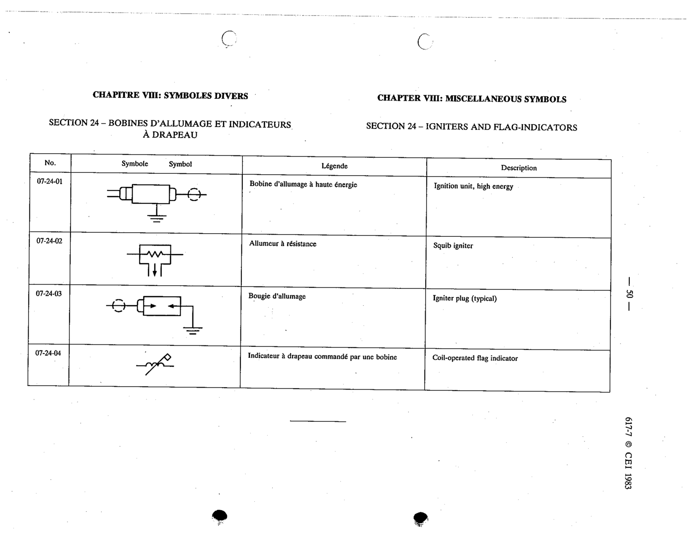

# 07-24-02 — Squib igniter

This symbol appears on Publication No.617-7.pdf, printed p.50 (full page shown). 617-7 uses page-level images: its table layout is too irregular (intro text, notes, text-only rows) for reliable per-symbol cropping.

**Standard:** [[60617-7]] · **Section:** [[60617-7-24-igniters-and-flag-indicators]]

## Description
Squib igniter

## Names
- **EN:** Squib igniter
- **FR:** Allumeur à résistance

