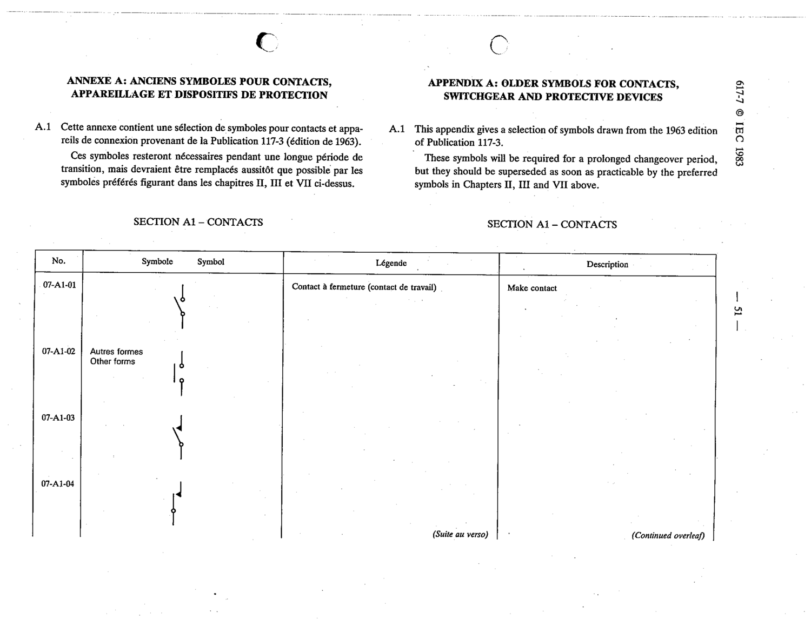

# 07-A1-01 — Make contact (older symbol)

This symbol appears on Publication No.617-7.pdf, printed p.51 (full page shown). 617-7 uses page-level images: its table layout is too irregular (intro text, notes, text-only rows) for reliable per-symbol cropping.

**Standard:** [[60617-7]] · **Section:** [[60617-7-A1-appendix-a-older-symbols]]

## Description
Make contact (older symbol)

## Names
- **EN:** Make contact (older symbol)
- **FR:** Contact à fermeture (contact de travail)

## Related
- [[07-02-01]]
