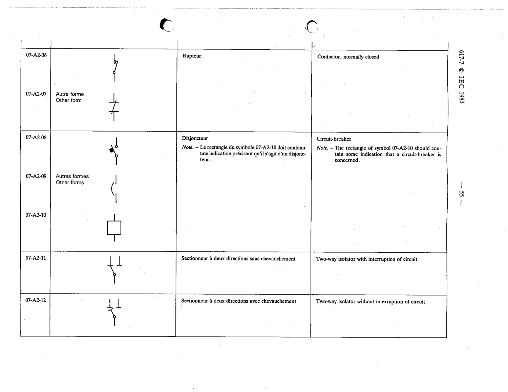

# 07-A2-08 — Circuit-breaker (older symbol)

This symbol appears on Publication No.617-7.pdf, printed p.55 (full page shown). 617-7 uses page-level images: its table layout is too irregular (intro text, notes, text-only rows) for reliable per-symbol cropping.

**Standard:** [[60617-7]] · **Section:** [[60617-7-A2-appendix-a-older-symbols]]

## Description
Circuit-breaker (older symbol)

## Names
- **EN:** Circuit-breaker (older symbol)
- **FR:** Disjoncteur

## Notes
- The rectangle of symbol 07-A2-10 should contain some indication that a circuit-breaker is concerned.

## Related
- [[07-A2-10]]
