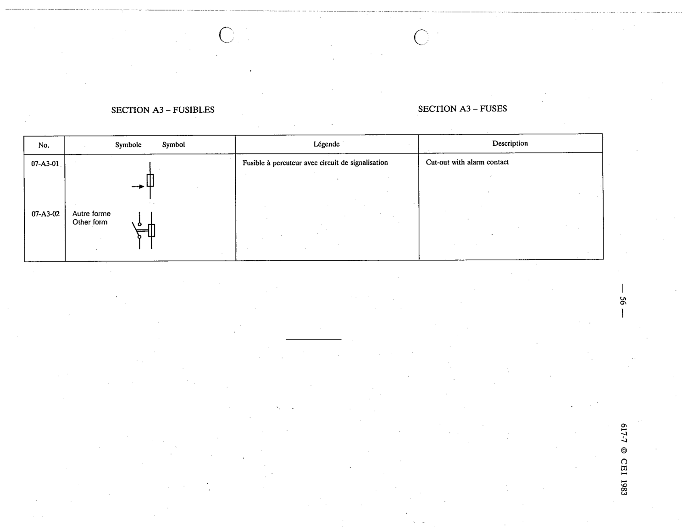

# 07-A3-01 — Cut-out with alarm contact (older symbol)

This symbol appears on Publication No.617-7.pdf, printed p.56 (full page shown). 617-7 uses page-level images: its table layout is too irregular (intro text, notes, text-only rows) for reliable per-symbol cropping.

**Standard:** [[60617-7]] · **Section:** [[60617-7-A3-appendix-a-older-symbols]]

## Description
Cut-out with alarm contact (older symbol)

## Names
- **EN:** Cut-out with alarm contact (older symbol)
- **FR:** Fusible à percuteur avec circuit de signalisation

