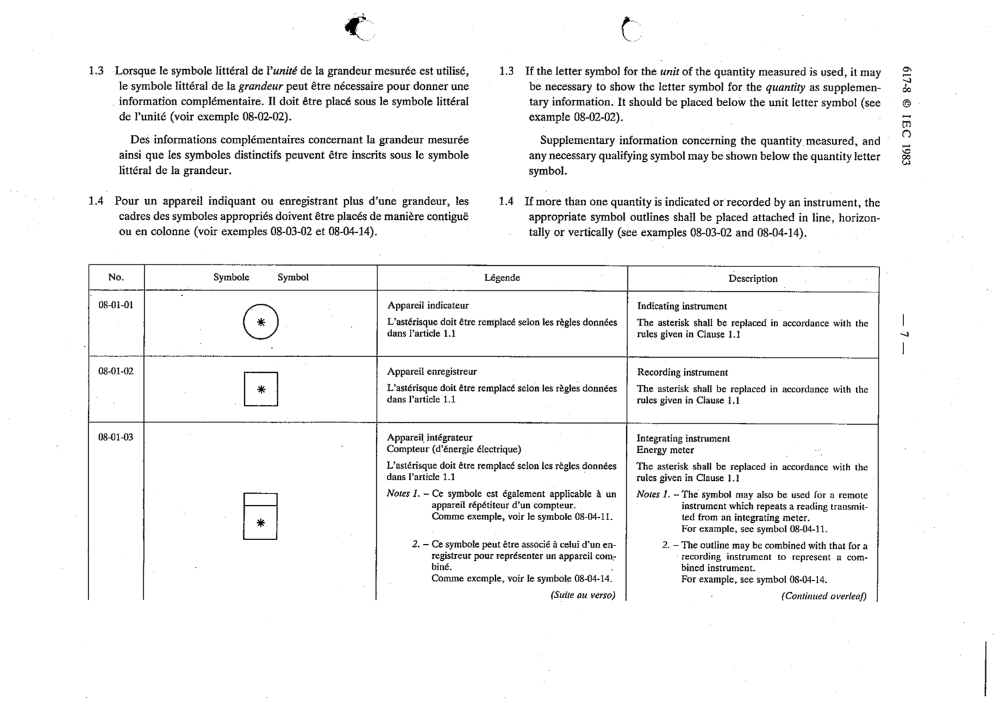

# 08-01-01 — Indicating instrument

This symbol appears on Publication No.617-8.pdf, printed p.7 (full page shown).

**Standard:** [[60617-8]] · **Section:** [[60617-8-01-general]]

## Description
Indicating instrument. The asterisk shall be replaced in accordance with the rules given in Clause 1.1.

## Names
- **EN:** Indicating instrument
- **FR:** Appareil indicateur

