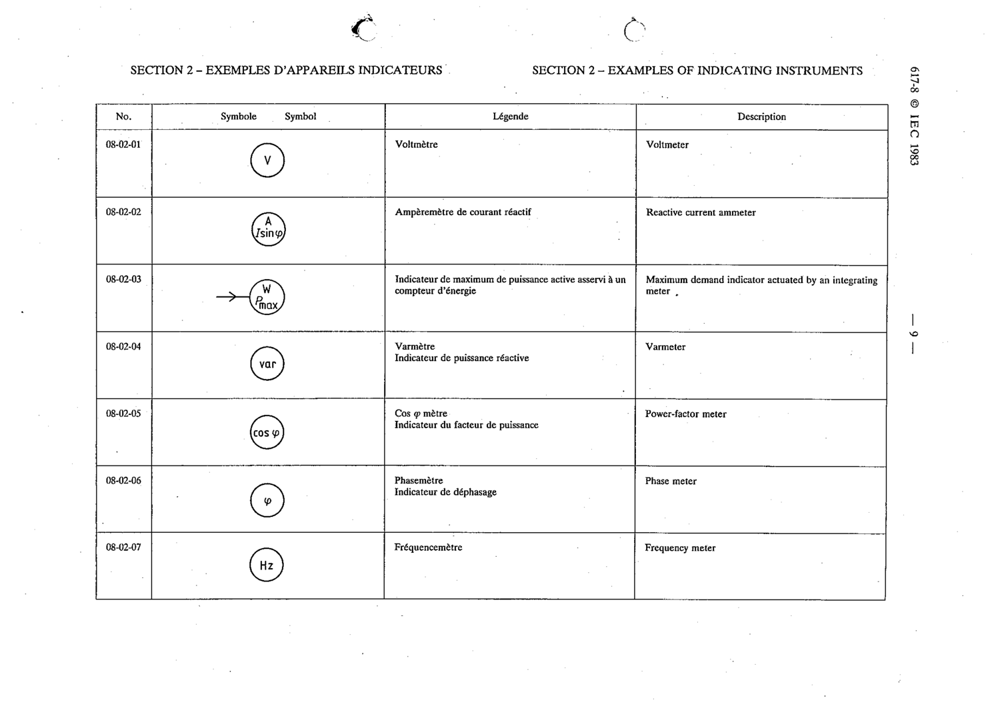

# 08-02-03 — Maximum demand indicator actuated by an integrating meter

This symbol appears on Publication No.617-8.pdf, printed p.9 (full page shown).

**Standard:** [[60617-8]] · **Section:** [[60617-8-02-examples-of-indicating-instruments]]

## Description
Maximum demand indicator actuated by an integrating meter.

## Names
- **EN:** Maximum demand indicator actuated by an integrating meter
- **FR:** Indicateur de maximum de puissance active asservi à un compteur d'énergie

