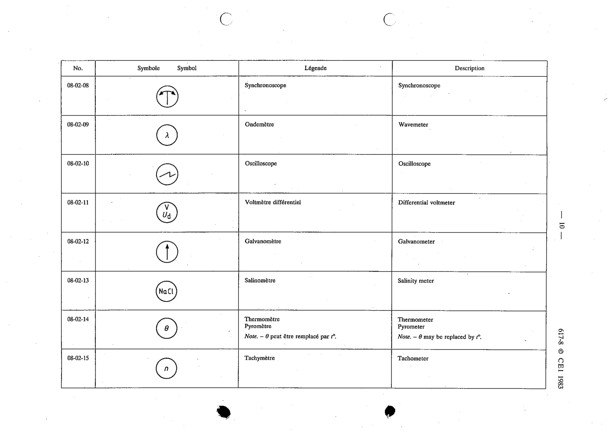

# 08-02-08 — Synchronoscope

This symbol appears on Publication No.617-8.pdf, printed p.10 (full page shown).

**Standard:** [[60617-8]] · **Section:** [[60617-8-02-examples-of-indicating-instruments]]

## Description
Synchronoscope.

## Names
- **EN:** Synchronoscope
- **FR:** Synchronoscope

