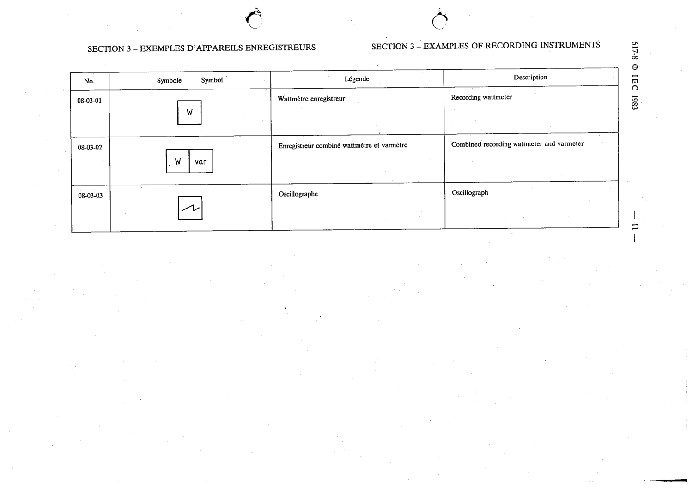

# 08-03-03 — Oscillograph

This symbol appears on Publication No.617-8.pdf, printed p.11 (full page shown).

**Standard:** [[60617-8]] · **Section:** [[60617-8-03-examples-of-recording-instruments]]

## Description
Oscillograph.

## Names
- **EN:** Oscillograph
- **FR:** Oscillographe

