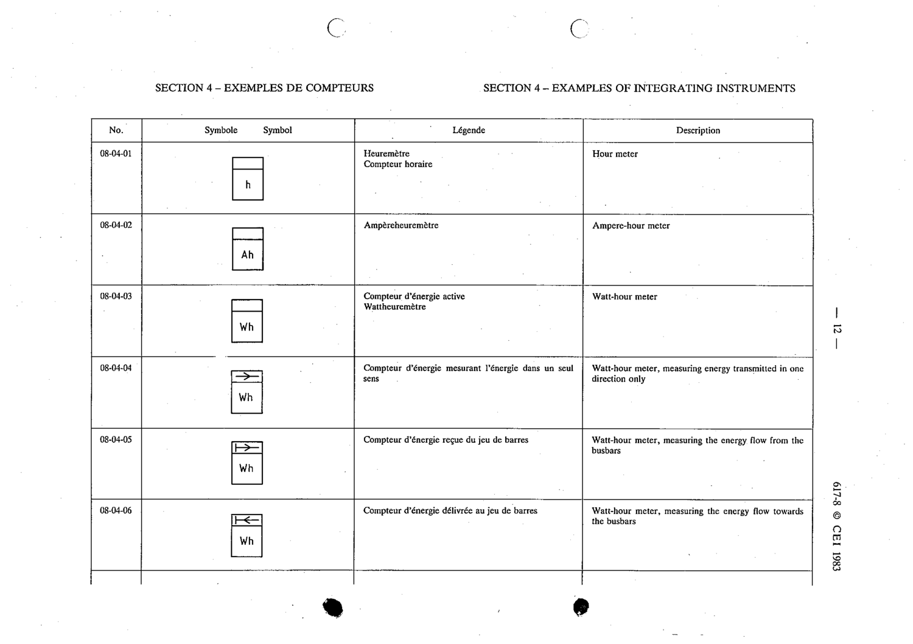

# 08-04-05 — Watt-hour meter, measuring the energy flow from the busbars

This symbol appears on Publication No.617-8.pdf, printed p.12 (full page shown).

**Standard:** [[60617-8]] · **Section:** [[60617-8-04-examples-of-integrating-instruments]]

## Description
Watt-hour meter, measuring the energy flow from the busbars.

## Names
- **EN:** Watt-hour meter, measuring the energy flow from the busbars
- **FR:** Compteur d'énergie reçue du jeu de barres

