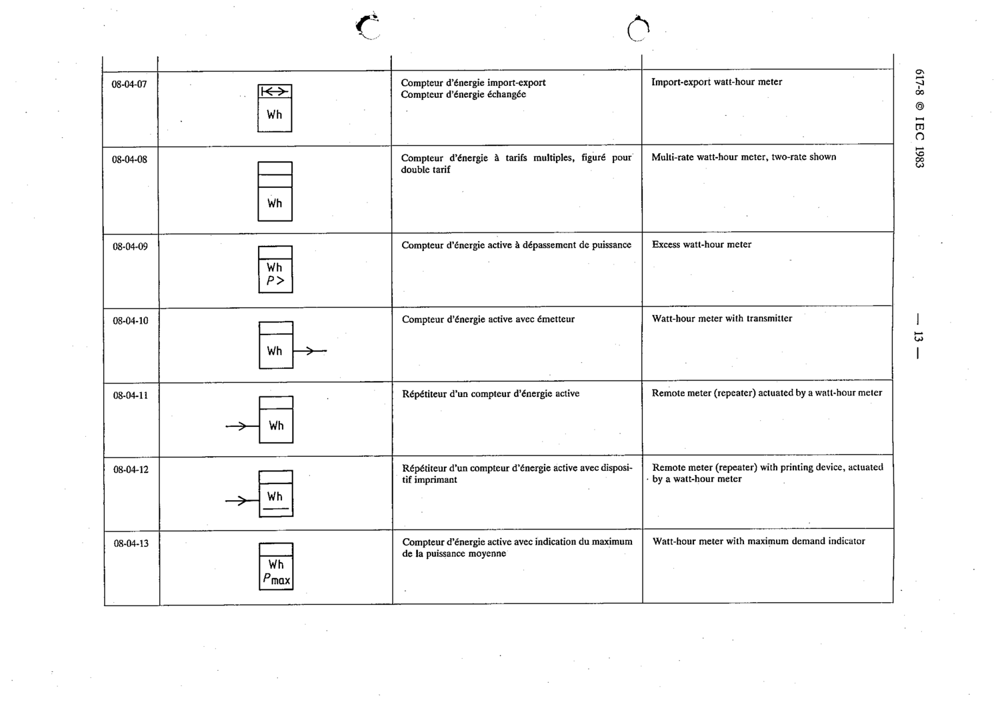

# 08-04-08 — Multi-rate watt-hour meter, two-rate shown

This symbol appears on Publication No.617-8.pdf, printed p.13 (full page shown).

**Standard:** [[60617-8]] · **Section:** [[60617-8-04-examples-of-integrating-instruments]]

## Description
Multi-rate watt-hour meter, two-rate shown.

## Names
- **EN:** Multi-rate watt-hour meter, two-rate shown
- **FR:** Compteur d'énergie à tarifs multiples, figuré pour double tarif

