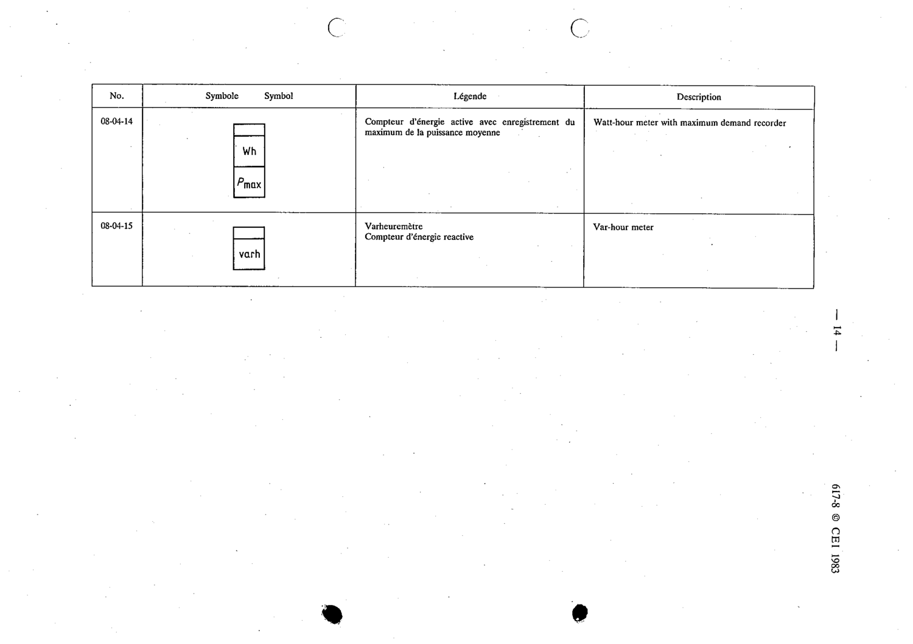

# 08-04-14 — Watt-hour meter with maximum demand recorder

This symbol appears on Publication No.617-8.pdf, printed p.14 (full page shown).

**Standard:** [[60617-8]] · **Section:** [[60617-8-04-examples-of-integrating-instruments]]

## Description
Watt-hour meter with maximum demand recorder.

## Names
- **EN:** Watt-hour meter with maximum demand recorder
- **FR:** Compteur d'énergie active avec enregistrement du maximum de la puissance moyenne

