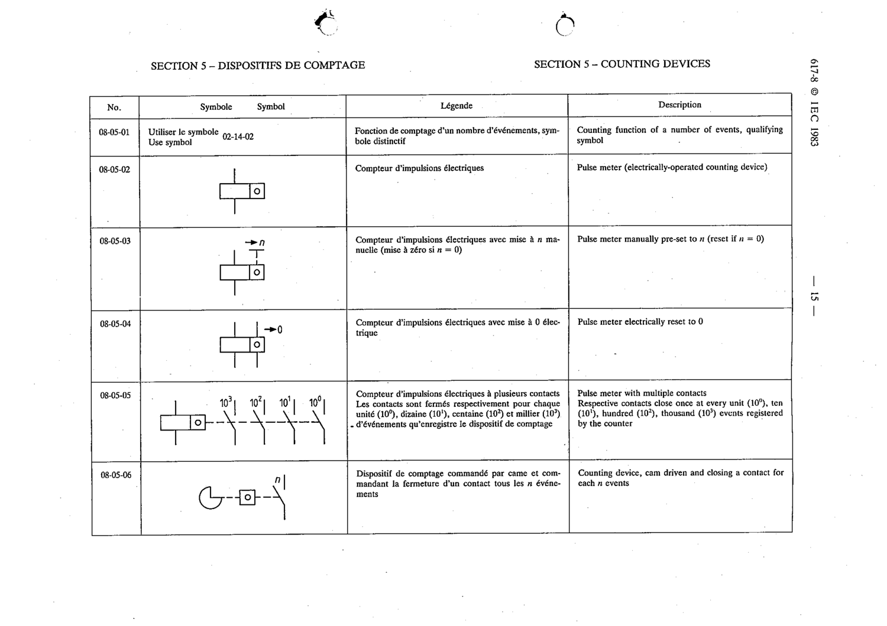

# 08-05-05 — Pulse meter with multiple contacts

This symbol appears on Publication No.617-8.pdf, printed p.15 (full page shown).

**Standard:** [[60617-8]] · **Section:** [[60617-8-05-counting-devices]]

## Description
Pulse meter with multiple contacts. Respective contacts close once at every unit (10^0), ten (10^1), hundred (10^2), thousand (10^3) events registered.

## Names
- **EN:** Pulse meter with multiple contacts
- **FR:** Compteur d'impulsions électriques à plusieurs contacts

