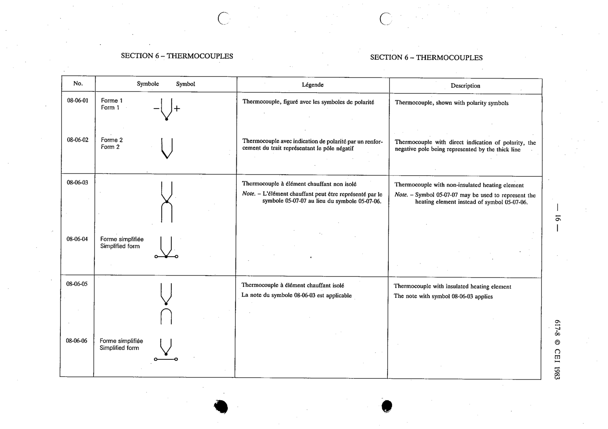

# 08-06-03 — Thermocouple with non-insulated heating element

This symbol appears on Publication No.617-8.pdf, printed p.16 (full page shown).

**Standard:** [[60617-8]] · **Section:** [[60617-8-06-thermocouples]]

## Description
Thermocouple with non-insulated heating element.

## Names
- **EN:** Thermocouple with non-insulated heating element
- **FR:** Thermocouple à élément chauffant non isolé

## Notes
- Symbol 05-07-07 may be used to represent the heating element instead of symbol 05-07-06.

## Related
- [[05-07-06]]
- [[05-07-07]]
