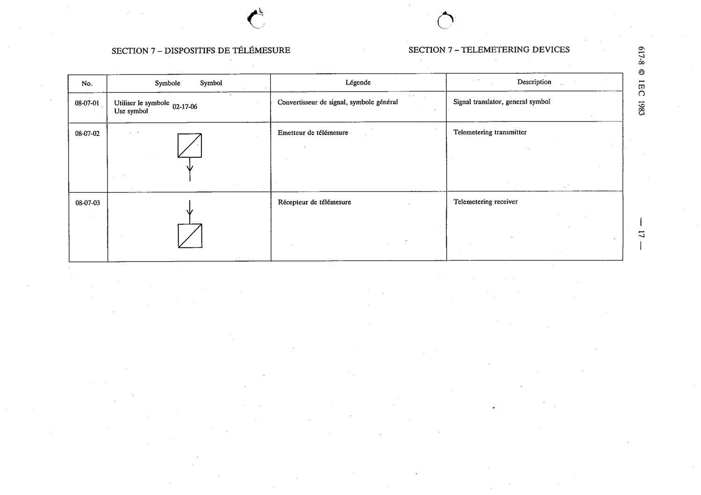

# 08-07-01 — Signal translator, general symbol

This symbol appears on Publication No.617-8.pdf, printed p.17 (full page shown).

**Standard:** [[60617-8]] · **Section:** [[60617-8-07-telemetering-devices]]

## Description
Signal translator, general symbol. Use symbol 02-17-06.

## Names
- **EN:** Signal translator, general symbol
- **FR:** Convertisseur de signal, symbole général

## Related
- [[02-17-06]]
