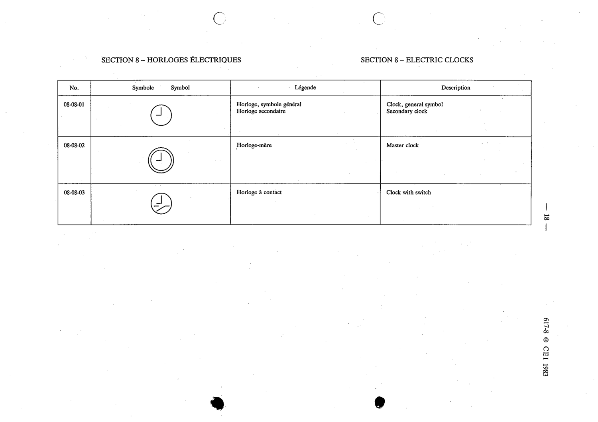

# 08-08-03 — Clock with switch

This symbol appears on Publication No.617-8.pdf, printed p.18 (full page shown).

**Standard:** [[60617-8]] · **Section:** [[60617-8-08-electric-clocks]]

## Description
Clock with switch.

## Names
- **EN:** Clock with switch
- **FR:** Horloge à contact

