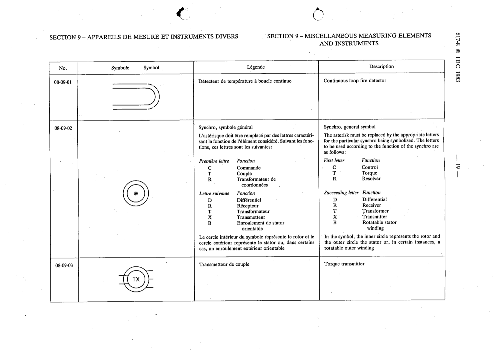

# 08-09-03 — Torque transmitter

This symbol appears on Publication No.617-8.pdf, printed p.19 (full page shown).

**Standard:** [[60617-8]] · **Section:** [[60617-8-09-miscellaneous-measuring-elements-and]]

## Description
Torque transmitter.

## Names
- **EN:** Torque transmitter
- **FR:** Transmetteur de couple

