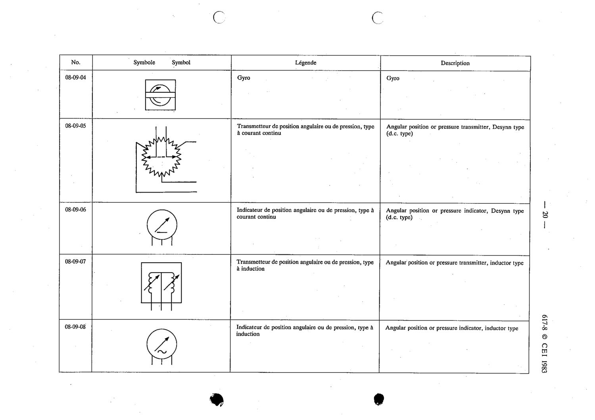

# 08-09-06 — Angular position or pressure indicator, Desynn type (d.c.)

This symbol appears on Publication No.617-8.pdf, printed p.20 (full page shown).

**Standard:** [[60617-8]] · **Section:** [[60617-8-09-miscellaneous-measuring-elements-and]]

## Description
Angular position or pressure indicator, Desynn type (d.c. type).

## Names
- **EN:** Angular position or pressure indicator, Desynn type (d.c.)
- **FR:** Indicateur de position angulaire ou de pression, type à courant continu

