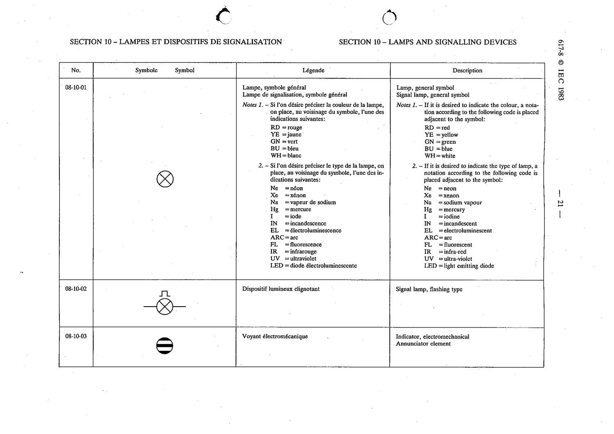

# 08-10-01 — Lamp, general symbol; signal lamp, general symbol

This symbol appears on Publication No.617-8.pdf, printed p.21 (full page shown).

**Standard:** [[60617-8]] · **Section:** [[60617-8-10-lamps-and-signalling-devices]]

## Description
Lamp / signal lamp, general symbol.

## Names
- **EN:** Lamp, general symbol; signal lamp, general symbol
- **FR:** Lampe, symbole général; lampe de signalisation, symbole général

## Notes
- Colour code placed adjacent: RD=red, YE=yellow, GN=green, BU=blue, WH=white.
- Type code placed adjacent: Ne=neon, Xe=xenon, Na=sodium, Hg=mercury, I=iodine, IN=incandescent, EL=electroluminescent, ARC=arc, FL=fluorescent, IR=infra-red, UV=ultra-violet, LED=light emitting diode.

