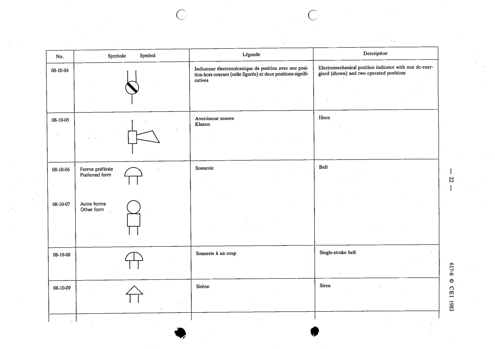

# 08-10-04 — Electromechanical position indicator (one de-energized + two operated positions)

This symbol appears on Publication No.617-8.pdf, printed p.22 (full page shown).

**Standard:** [[60617-8]] · **Section:** [[60617-8-10-lamps-and-signalling-devices]]

## Description
Electromechanical position indicator with one de-energized (shown) and two operated positions.

## Names
- **EN:** Electromechanical position indicator (one de-energized + two operated positions)
- **FR:** Indicateur électromécanique de position

