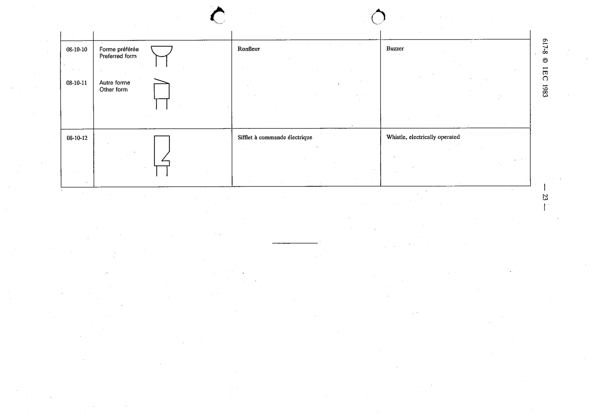

# 08-10-10 — Buzzer

This symbol appears on Publication No.617-8.pdf, printed p.23 (full page shown).

**Standard:** [[60617-8]] · **Section:** [[60617-8-10-lamps-and-signalling-devices]] · **Preferred form**

## Description
Buzzer (preferred form).

## Names
- **EN:** Buzzer
- **FR:** Ronfleur

## Related
- [[08-10-11]]
