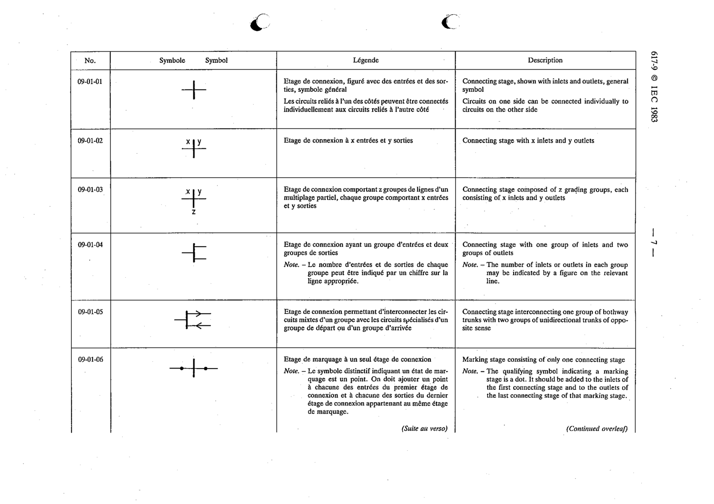

# 09-01-06 — Marking stage consisting of only one connecting stage

This symbol appears on Publication No.617-9.pdf, printed p.7 (full page shown).

**Standard:** [[60617-9]] · **Section:** [[60617-9-01-switching-networks]]

## Description
Marking stage consisting of only one connecting stage.

## Names
- **EN:** Marking stage consisting of only one connecting stage
- **FR:** Étage de marquage à un seul étage de connexion

## Notes
- The qualifying symbol indicating a marking stage is a dot, added to the inlets of the first connecting stage and the outlets of the last connecting stage of that marking stage.

