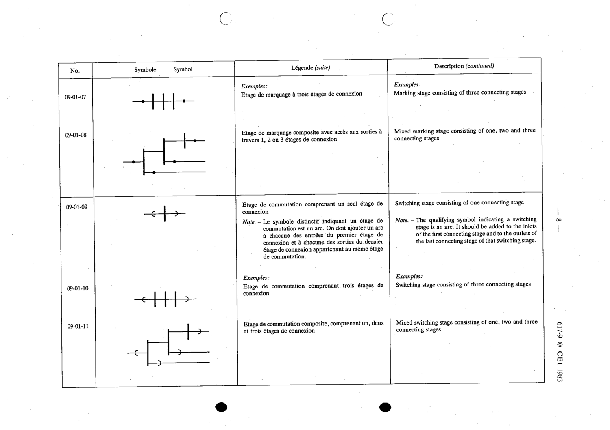

# 09-01-09 — Switching stage consisting of one connecting stage

This symbol appears on Publication No.617-9.pdf, printed p.8 (full page shown).

**Standard:** [[60617-9]] · **Section:** [[60617-9-01-switching-networks]]

## Description
Switching stage consisting of one connecting stage.

## Names
- **EN:** Switching stage consisting of one connecting stage
- **FR:** Étage de commutation comprenant un seul étage de connexion

## Notes
- The qualifying symbol indicating a switching stage is an arc, added to the inlets of the first connecting stage and the outlets of the last connecting stage of that switching stage.

