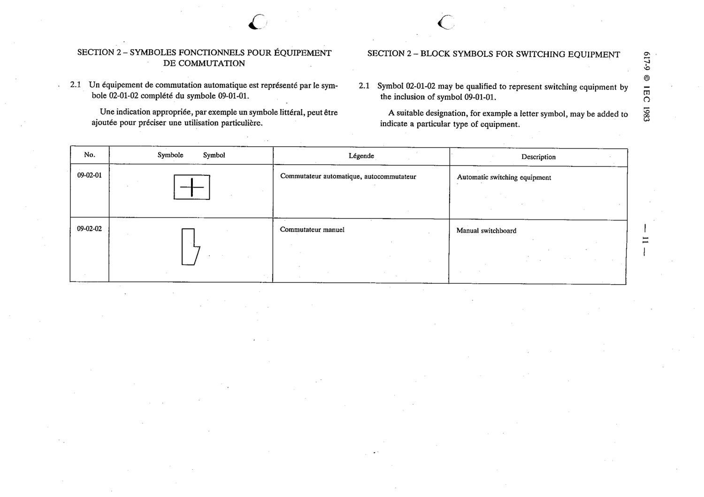

# 09-02-02 — Manual switchboard

This symbol appears on Publication No.617-9.pdf, printed p.11 (full page shown).

**Standard:** [[60617-9]] · **Section:** [[60617-9-02-block-symbols-for-switching]]

## Description
Manual switchboard.

## Names
- **EN:** Manual switchboard
- **FR:** Commutateur manuel

