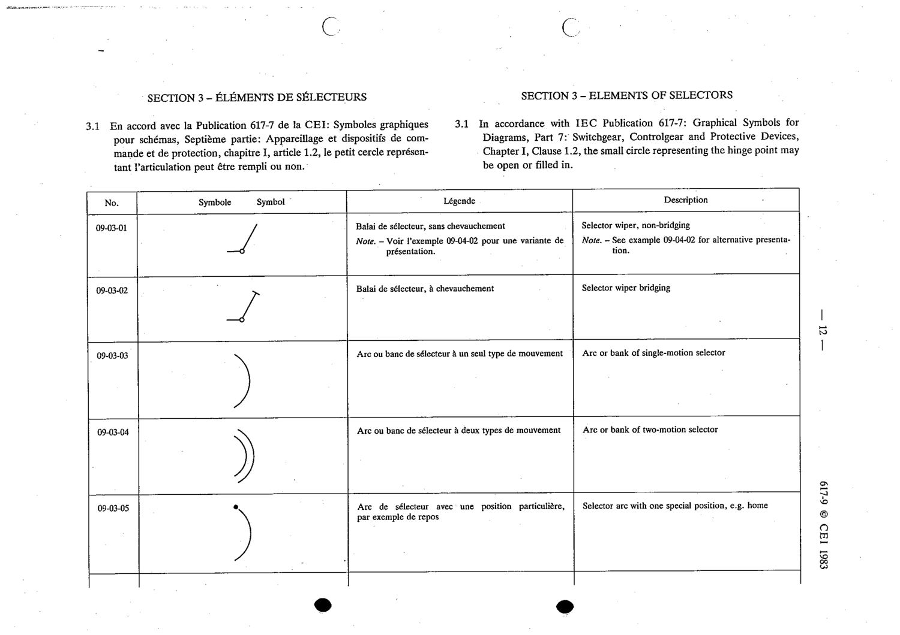

# 09-03-05 — Selector arc with one special position, e.g. home

This symbol appears on Publication No.617-9.pdf, printed p.12 (full page shown).

**Standard:** [[60617-9]] · **Section:** [[60617-9-03-elements-of-selectors]]

## Description
Selector arc with one special position, e.g. home.

## Names
- **EN:** Selector arc with one special position, e.g. home
- **FR:** Arc de sélecteur avec une position particulière, par exemple de repos

