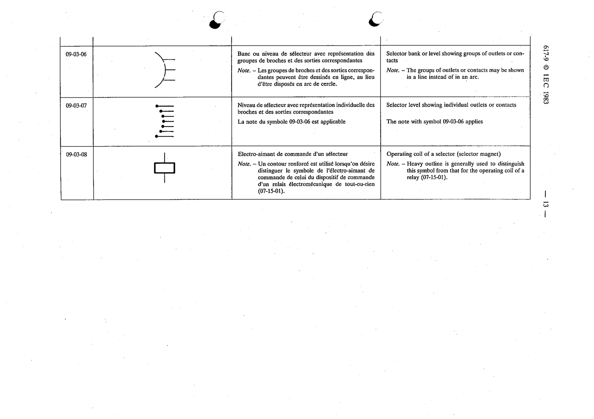

# 09-03-06 — Selector bank or level showing groups of outlets or contacts

This symbol appears on Publication No.617-9.pdf, printed p.13 (full page shown).

**Standard:** [[60617-9]] · **Section:** [[60617-9-03-elements-of-selectors]]

## Description
Selector bank or level showing groups of outlets or contacts.

## Names
- **EN:** Selector bank or level showing groups of outlets or contacts
- **FR:** Banc ou niveau de sélecteur avec représentation des groupes de broches et des sorties correspondantes

## Notes
- The groups of outlets or contacts may be shown in a line instead of in an arc.

