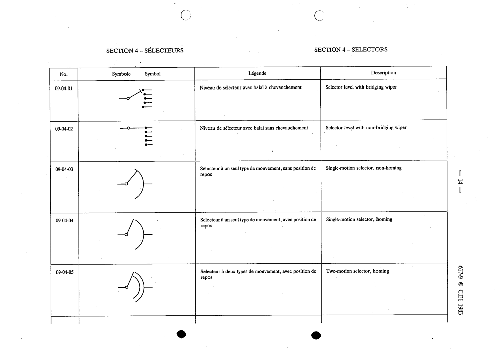

# 09-04-04 — Single-motion selector, homing

This symbol appears on Publication No.617-9.pdf, printed p.14 (full page shown).

**Standard:** [[60617-9]] · **Section:** [[60617-9-04-selectors]]

## Description
Single-motion selector, homing.

## Names
- **EN:** Single-motion selector, homing
- **FR:** Sélecteur à un seul type de mouvement, avec position de repos

