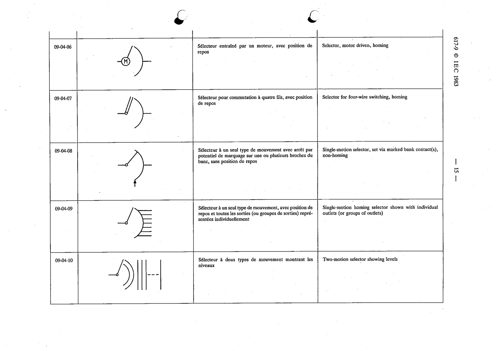

# 09-04-09 — Single-motion homing selector shown with individual outlets (or groups of outlets)

This symbol appears on Publication No.617-9.pdf, printed p.15 (full page shown).

**Standard:** [[60617-9]] · **Section:** [[60617-9-04-selectors]]

## Description
Single-motion homing selector shown with individual outlets (or groups of outlets).

## Names
- **EN:** Single-motion homing selector shown with individual outlets (or groups of outlets)
- **FR:** Sélecteur à un seul type de mouvement, avec position de repos et toutes les sorties représentées individuellement

