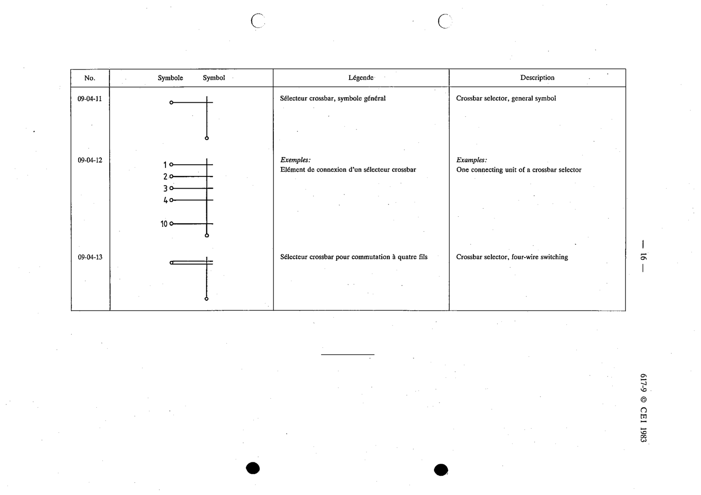

# 09-04-12 — One connecting unit of a crossbar selector

This symbol appears on Publication No.617-9.pdf, printed p.16 (full page shown).

**Standard:** [[60617-9]] · **Section:** [[60617-9-04-selectors]]

## Description
One connecting unit of a crossbar selector.

## Names
- **EN:** One connecting unit of a crossbar selector
- **FR:** Élément de connexion d'un sélecteur crossbar

