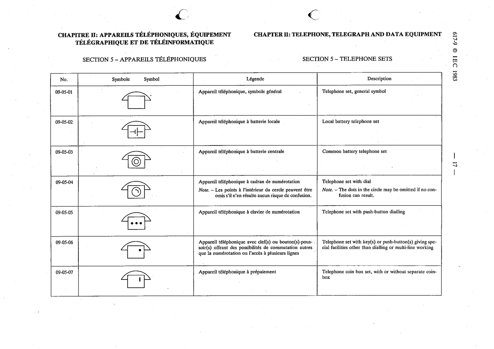

# 09-05-06 — Telephone set with key(s) or push-button(s) giving special facilities

This symbol appears on Publication No.617-9.pdf, printed p.17 (full page shown).

**Standard:** [[60617-9]] · **Section:** [[60617-9-05-telephone-sets]]

## Description
Telephone set with key(s) or push-button(s) giving special facilities other than dialling or multi-line working.

## Names
- **EN:** Telephone set with key(s) or push-button(s) giving special facilities
- **FR:** Appareil téléphonique avec clé(s) ou bouton(s)-poussoir(s) offrant des possibilités de commutation

