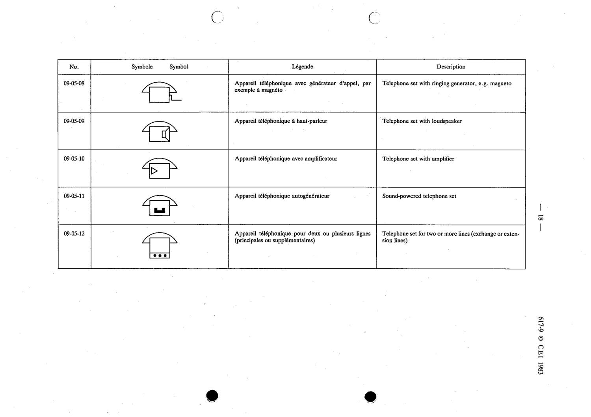

# 09-05-10 — Telephone set with amplifier

This symbol appears on Publication No.617-9.pdf, printed p.18 (full page shown).

**Standard:** [[60617-9]] · **Section:** [[60617-9-05-telephone-sets]]

## Description
Telephone set with amplifier.

## Names
- **EN:** Telephone set with amplifier
- **FR:** Appareil téléphonique avec amplificateur

