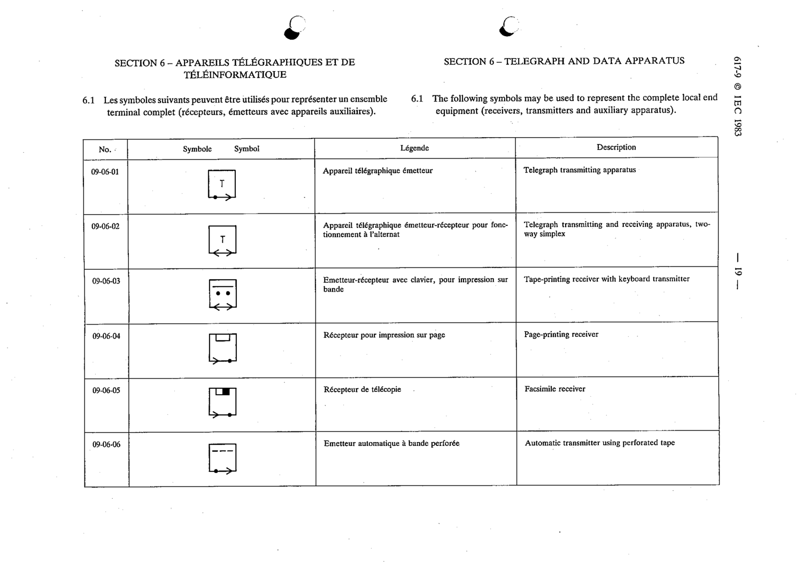

# 09-06-03 — Tape-printing receiver with keyboard transmitter

This symbol appears on Publication No.617-9.pdf, printed p.19 (full page shown).

**Standard:** [[60617-9]] · **Section:** [[60617-9-06-telegraph-and-data-apparatus]]

## Description
Tape-printing receiver with keyboard transmitter.

## Names
- **EN:** Tape-printing receiver with keyboard transmitter
- **FR:** Émetteur-récepteur avec clavier, pour impression sur bande

