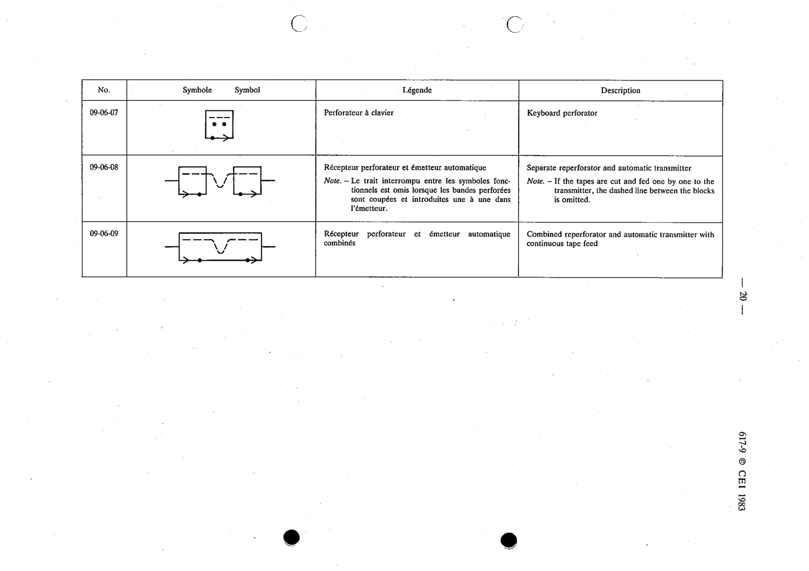

# 09-06-08 — Separate reperforator and automatic transmitter

This symbol appears on Publication No.617-9.pdf, printed p.20 (full page shown).

**Standard:** [[60617-9]] · **Section:** [[60617-9-06-telegraph-and-data-apparatus]]

## Description
Separate reperforator and automatic transmitter.

## Names
- **EN:** Separate reperforator and automatic transmitter
- **FR:** Récepteur perforateur et émetteur automatique séparés

## Notes
- If the tapes are cut and fed one by one to the transmitter, the dashed line between the blocks is omitted.

