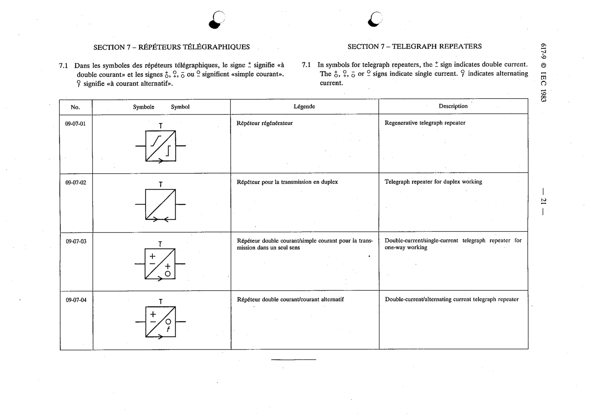

# 09-07-02 — Telegraph repeater for duplex working

This symbol appears on Publication No.617-9.pdf, printed p.21 (full page shown).

**Standard:** [[60617-9]] · **Section:** [[60617-9-07-telegraph-repeaters]]

## Description
Telegraph repeater for duplex working.

## Names
- **EN:** Telegraph repeater for duplex working
- **FR:** Répéteur pour la transmission en duplex

