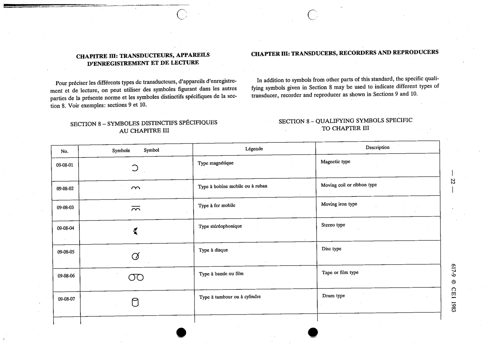

# 09-08-01 — Magnetic type

This symbol appears on Publication No.617-9.pdf, printed p.22 (full page shown).

**Standard:** [[60617-9]] · **Section:** [[60617-9-08-qualifying-symbols-specific-to]]

## Description
Magnetic type (qualifying symbol).

## Names
- **EN:** Magnetic type
- **FR:** Type magnétique

