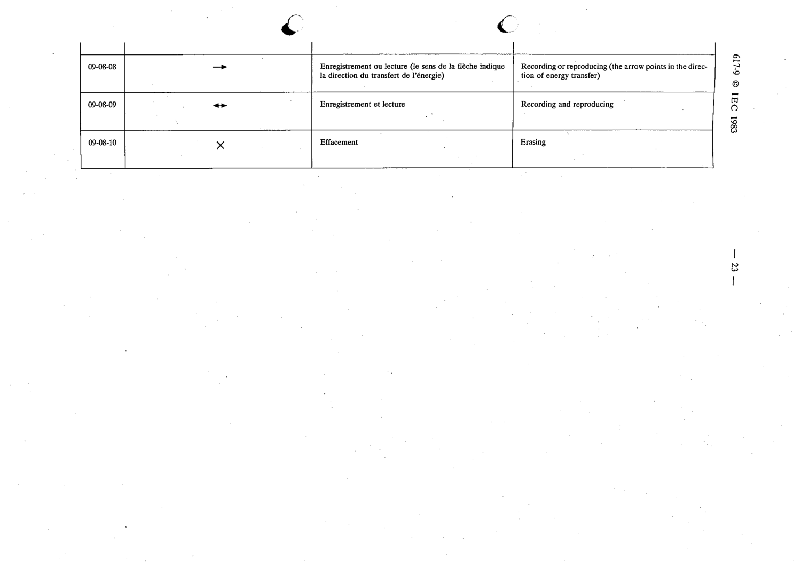

# 09-08-09 — Recording and reproducing

This symbol appears on Publication No.617-9.pdf, printed p.23 (full page shown).

**Standard:** [[60617-9]] · **Section:** [[60617-9-08-qualifying-symbols-specific-to]]

## Description
Recording and reproducing.

## Names
- **EN:** Recording and reproducing
- **FR:** Enregistrement et lecture

