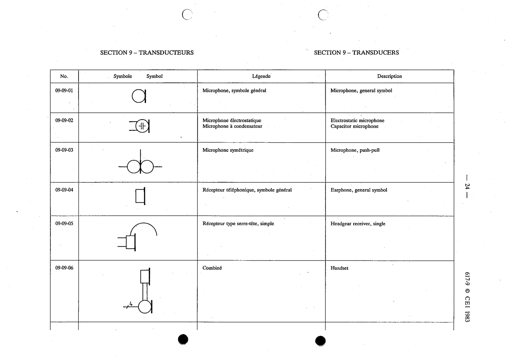

# 09-09-05 — Headgear receiver, single

This symbol appears on Publication No.617-9.pdf, printed p.24 (full page shown).

**Standard:** [[60617-9]] · **Section:** [[60617-9-09-transducers]]

## Description
Headgear receiver, single.

## Names
- **EN:** Headgear receiver, single
- **FR:** Récepteur type serre-tête, simple

