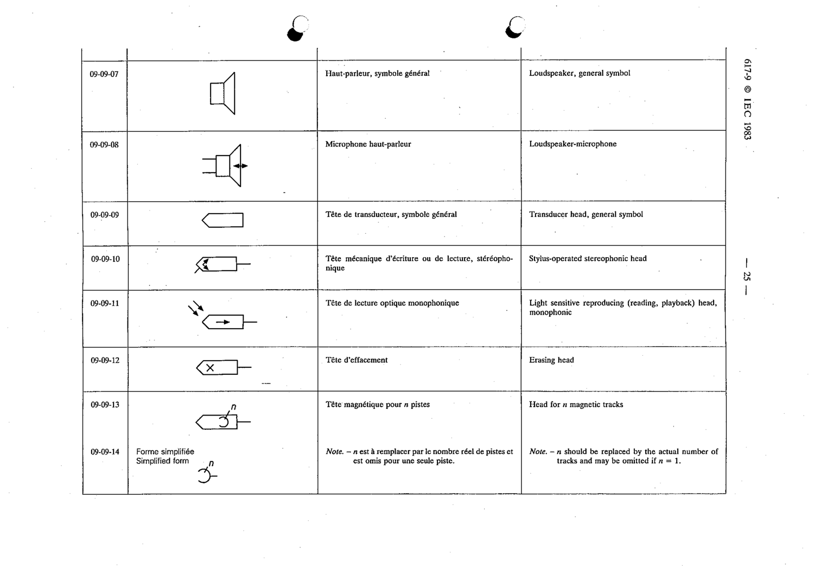

# 09-09-14 — Head for n magnetic tracks, simplified form

This symbol appears on Publication No.617-9.pdf, printed p.25 (full page shown).

**Standard:** [[60617-9]] · **Section:** [[60617-9-09-transducers]] · **Simplified form**

## Description
Head for n magnetic tracks, simplified form.

## Names
- **EN:** Head for n magnetic tracks, simplified form
- **FR:** Tête magnétique pour n pistes, forme simplifiée

## Notes
- n should be replaced by the actual number of tracks and may be omitted if n = 1.

## Related
- [[09-09-13]]
