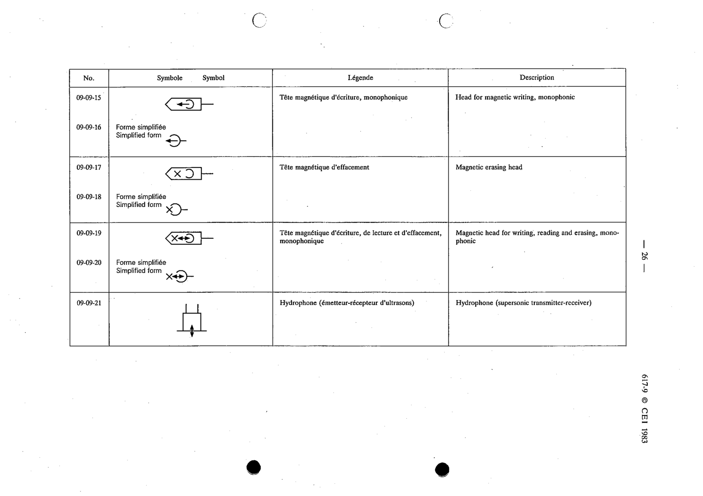

# 09-09-20 — Magnetic head for writing, reading and erasing, monophonic, simplified form

This symbol appears on Publication No.617-9.pdf, printed p.26 (full page shown).

**Standard:** [[60617-9]] · **Section:** [[60617-9-09-transducers]] · **Simplified form**

## Description
Magnetic head for writing, reading and erasing, monophonic, simplified form.

## Names
- **EN:** Magnetic head for writing, reading and erasing, monophonic, simplified form
- **FR:** Tête magnétique d'écriture, de lecture et d'effacement, monophonique, forme simplifiée

## Related
- [[09-09-19]]
