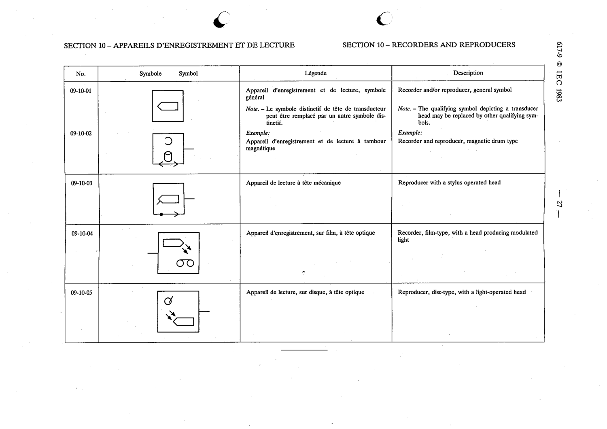

# 09-10-03 — Reproducer with a stylus operated head

This symbol appears on Publication No.617-9.pdf, printed p.27 (full page shown).

**Standard:** [[60617-9]] · **Section:** [[60617-9-10-recorders-and-reproducers]]

## Description
Reproducer with a stylus operated head.

## Names
- **EN:** Reproducer with a stylus operated head
- **FR:** Appareil de lecture à tête mécanique

