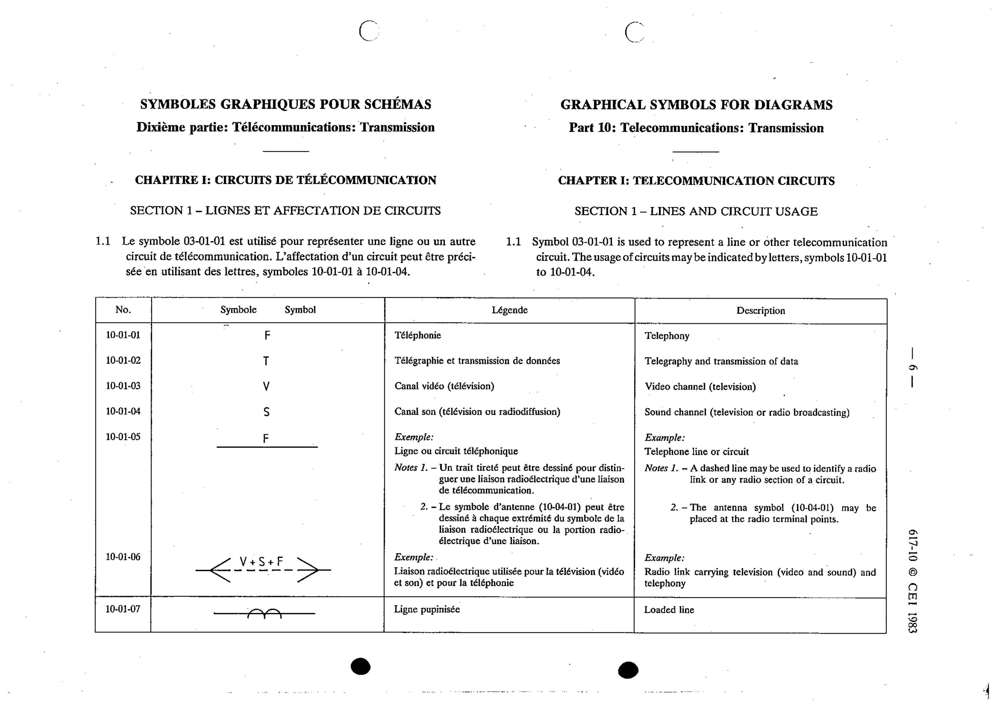

# 10-01-05 — Telephone line or circuit

This symbol appears on Publication No.617-10.pdf, printed p.6 (full page shown).

**Standard:** [[60617-10]] · **Section:** [[60617-10-01-lines-and-circuit-usage]]

## Description
Example: telephone line or circuit.

## Names
- **EN:** Telephone line or circuit
- **FR:** Ligne ou circuit téléphonique

## Notes
- A dashed line may be used to identify a radio link or any radio section of a circuit.
- The antenna symbol (10-04-01) may be placed at the radio terminal points.

## Related
- [[10-04-01]]
