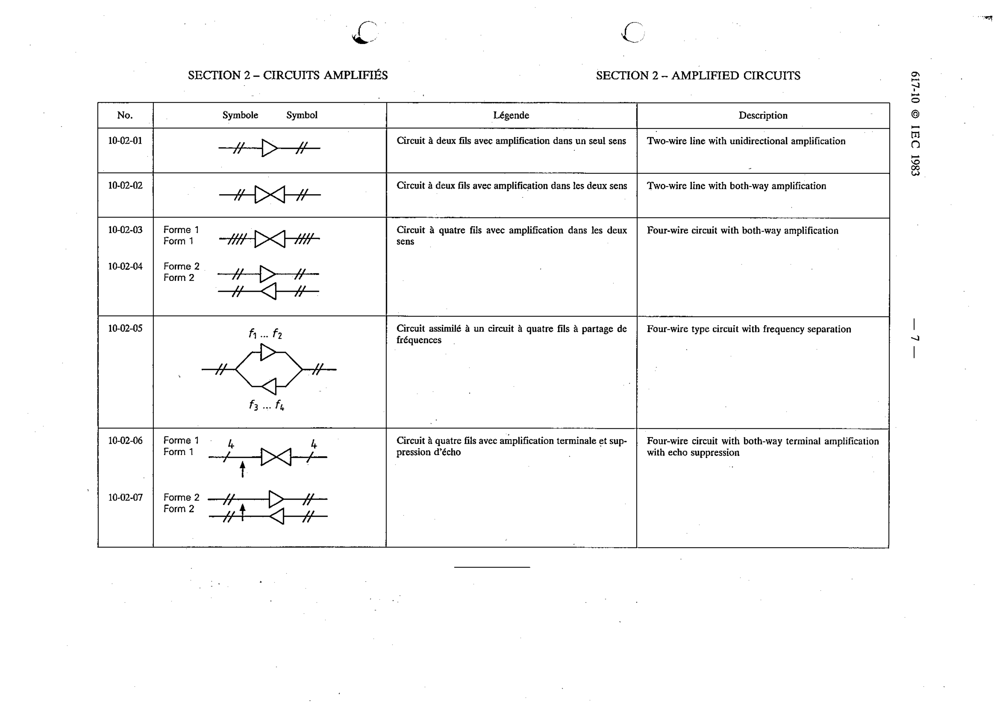

# 10-02-05 — Four-wire type circuit with frequency separation

This symbol appears on Publication No.617-10.pdf, printed p.7 (full page shown).

**Standard:** [[60617-10]] · **Section:** [[60617-10-02-amplified-circuits]]

## Description
Four-wire type circuit with frequency separation, shown with frequency bands f1…f2 and f3…f4 in the two directions.

## Names
- **EN:** Four-wire type circuit with frequency separation
- **FR:** Circuit assimilé à un circuit à quatre fils à partage de fréquences

