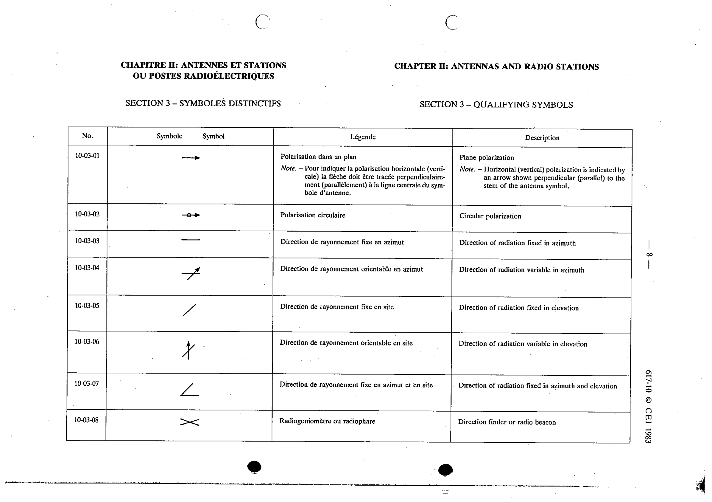

# 10-03-02 — Circular polarization

This symbol appears on Publication No.617-10.pdf, printed p.8 (full page shown).

**Standard:** [[60617-10]] · **Section:** [[60617-10-03-qualifying-symbols]]

## Description
Circular polarization.

## Names
- **EN:** Circular polarization
- **FR:** Polarisation circulaire

