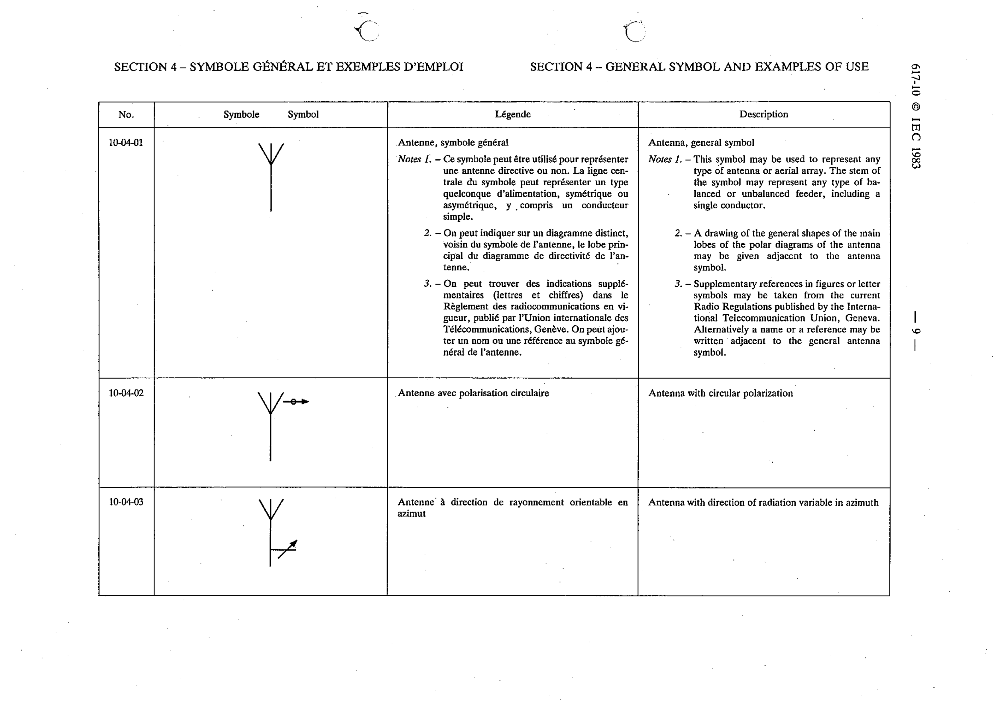

# 10-04-01 — Antenna, general symbol

This symbol appears on Publication No.617-10.pdf, printed p.9 (full page shown).

**Standard:** [[60617-10]] · **Section:** [[60617-10-04-general-symbol-and-examples]]

## Description
Antenna, general symbol.

## Names
- **EN:** Antenna, general symbol
- **FR:** Antenne, symbole général

## Notes
- This symbol may be used to represent any type of antenna or aerial array. The stem of the symbol may represent any type of balanced or unbalanced feeder, including a single conductor.
- A drawing of the general shapes of the main lobes of the polar diagrams of the antenna may be given adjacent to the antenna symbol.
- Supplementary references in figures or letter symbols may be taken from the current Radio Regulations published by the International Telecommunication Union, Geneva. Alternatively a name or a reference may be written adjacent to the general antenna symbol.

