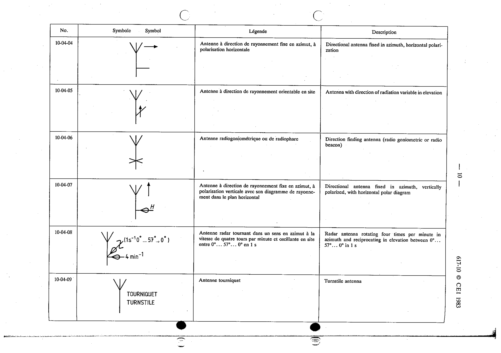

# 10-04-05 — Antenna with direction of radiation variable in elevation

This symbol appears on Publication No.617-10.pdf, printed p.10 (full page shown).

**Standard:** [[60617-10]] · **Section:** [[60617-10-04-general-symbol-and-examples]]

## Description
Antenna with direction of radiation variable in elevation.

## Names
- **EN:** Antenna with direction of radiation variable in elevation
- **FR:** Antenne à direction de rayonnement orientable en site

