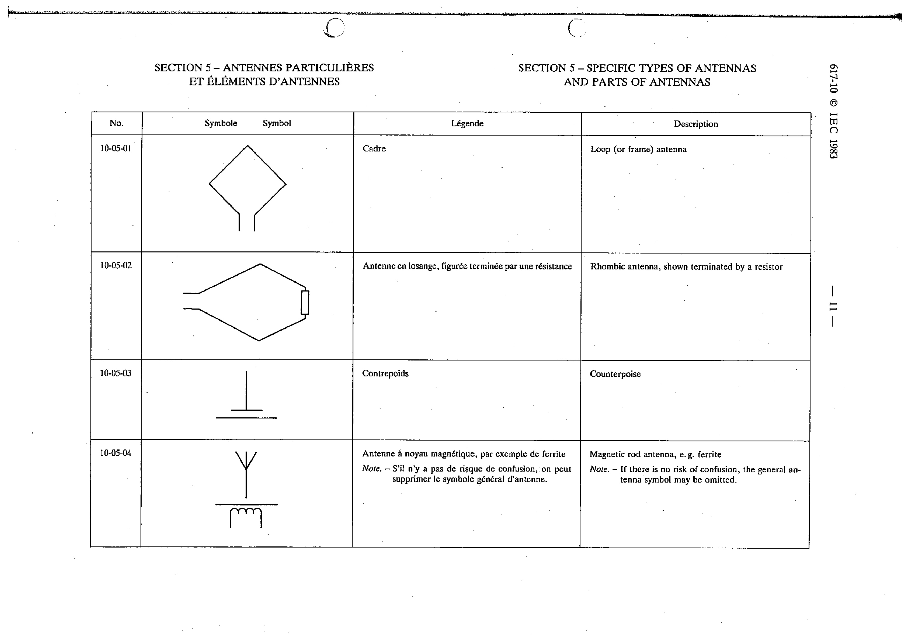

# 10-05-02 — Rhombic antenna, shown terminated by a resistor

This symbol appears on Publication No.617-10.pdf, printed p.11 (full page shown).

**Standard:** [[60617-10]] · **Section:** [[60617-10-05-specific-types-of-antennas]]

## Description
Rhombic antenna, shown terminated by a resistor.

## Names
- **EN:** Rhombic antenna, shown terminated by a resistor
- **FR:** Antenne en losange, figurée terminée par une résistance

