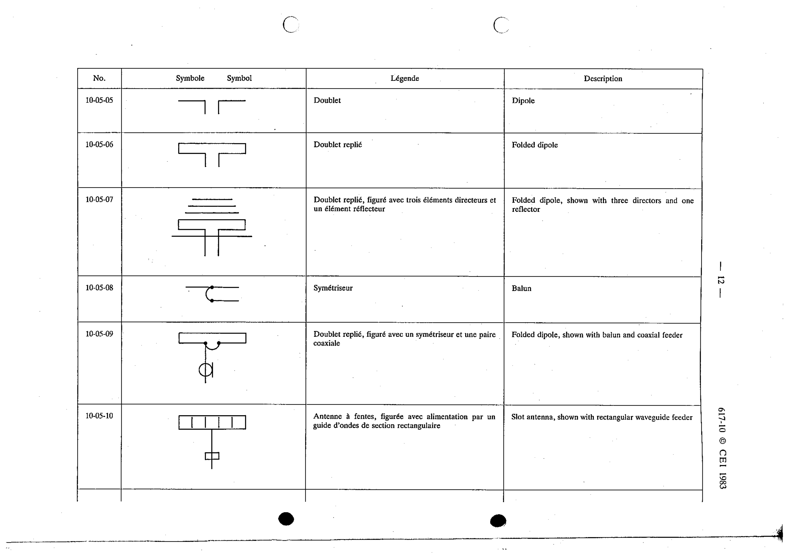

# 10-05-05 — Dipole

This symbol appears on Publication No.617-10.pdf, printed p.12 (full page shown).

**Standard:** [[60617-10]] · **Section:** [[60617-10-05-specific-types-of-antennas]]

## Description
Dipole.

## Names
- **EN:** Dipole
- **FR:** Doublet

