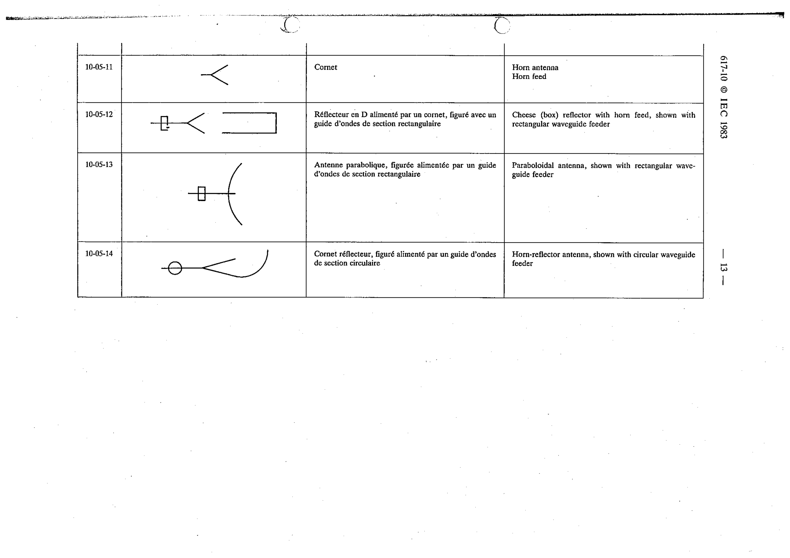

# 10-05-14 — Horn-reflector antenna, shown with circular waveguide feeder

This symbol appears on Publication No.617-10.pdf, printed p.13 (full page shown).

**Standard:** [[60617-10]] · **Section:** [[60617-10-05-specific-types-of-antennas]]

## Description
Horn-reflector antenna, shown with circular waveguide feeder.

## Names
- **EN:** Horn-reflector antenna, shown with circular waveguide feeder
- **FR:** Cornet réflecteur, figuré alimenté par un guide d'ondes de section circulaire

