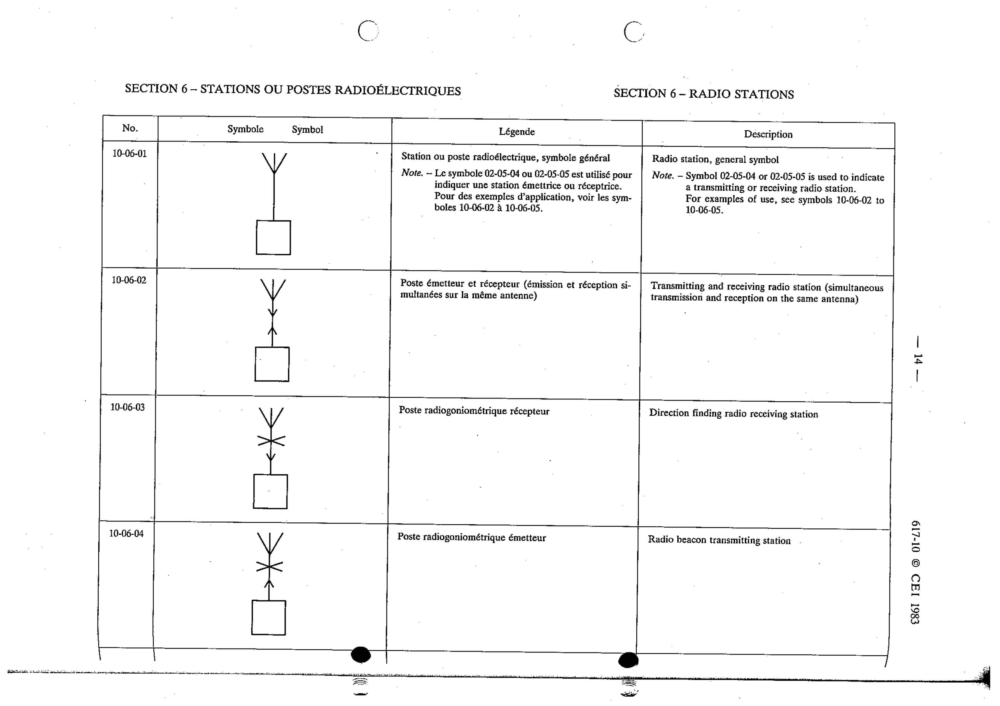

# 10-06-03 — Direction finding radio receiving station

This symbol appears on Publication No.617-10.pdf, printed p.14 (full page shown).

**Standard:** [[60617-10]] · **Section:** [[60617-10-06-radio-stations]]

## Description
Direction finding radio receiving station.

## Names
- **EN:** Direction finding radio receiving station
- **FR:** Poste radiogoniométrique récepteur

