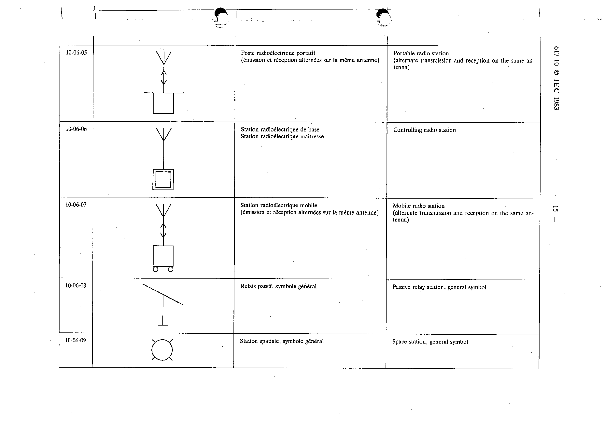

# 10-06-05 — Portable radio station (alternate transmission and reception on the same antenna)

This symbol appears on Publication No.617-10.pdf, printed p.15 (full page shown).

**Standard:** [[60617-10]] · **Section:** [[60617-10-06-radio-stations]]

## Description
Portable radio station (alternate transmission and reception on the same antenna).

## Names
- **EN:** Portable radio station (alternate transmission and reception on the same antenna)
- **FR:** Poste radioélectrique portatif (émission et réception alternées sur la même antenne)

